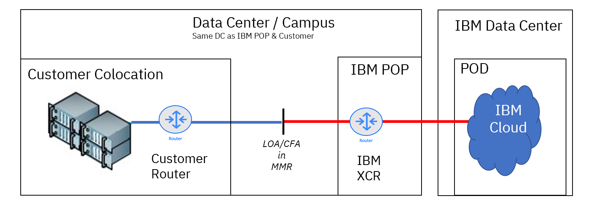

---

copyright:
  years: 2017, 2024
lastupdated: "2024-10-09"

keywords:

subcollection: direct-link

---

{{site.data.keyword.attribute-definition-list}}

# About Direct Link on Classic
{: #about-ibm-cloud-direct-link}

{{site.data.keyword.cloud}} Direct Link on Classic offerings provide connectivity from an external source into a customer's {{site.data.keyword.cloud_notm}} private network. Direct Link on Classic can be viewed as an alternative to a traditional site-to-site VPN solution, which is designed for customers that need more consistent, higher-throughput connectivity between a remote network and their {{site.data.keyword.cloud_notm}} environments.
{: shortdesc}

## Direct Link on Classic offerings
{: #overview-of-direct-link-offerings}

Four types of connections are available:
{: shortdesc}

* **Direct Link Connect on Classic** allows customers to use a connection through our Carrier partners who own and operate a facility-based network. A Connect provider is a network service provider (NSP) that is already connected to the {{site.data.keyword.cloud_notm}} network, by using multi-tenant, high capacity links (also known as a _network-to-network interface_, or NNI). Customers typically can purchase a virtual circuit at this provider, bringing connectivity at a reduced cost, because the physical connectivity from {{site.data.keyword.cloud_notm}} to the Connect provider is in place already, shared among other customers.

* **Direct Link Dedicated on Classic** allows customers to terminate a single-tenant, fiber-based cross-connect into the {{site.data.keyword.cloud_notm}} network. This offering can be used by customers with colocation premises that are next to {{site.data.keyword.cloud_notm}} PoPs and data centers; as well as network service providers that deliver circuits to customer premises or other data centers.

* **Direct Link Dedicated Hosting on Classic** provides connectivity similar to Direct Link Dedicated, but the connection point is next to an {{site.data.keyword.cloud_notm}} data center, which improves latency for higher-performance use cases. {{site.data.keyword.cloud_notm}} offers various customizable colocation services with this solution.

* **Direct Link Exchange on Classic** allows customers to use an Exchange provider to deliver connectivity to their {{site.data.keyword.cloud_notm}}. An Exchange provider is a colocation or data center provider that is already connected to the {{site.data.keyword.cloud_notm}} network, by using multi-tenant, high capacity links (also known as a _network-to-network interface_, or NNI). Customers typically can purchase a virtual circuit at this provider, bringing connectivity at a reduced cost, because the physical connectivity from {{site.data.keyword.cloud_notm}} to the Exchange provider is in place already, shared among other customers.

The {{site.data.keyword.cloud_notm}} Direct Link service is a routed, OSI Layer-3 service. It offers a direct connection to the {{site.data.keyword.cloud_notm}} private network backbone, with low latency and speeds up to 10 Gbps.
For increased flexibility in creating this Layer-3 connectivity, {{site.data.keyword.cloud_notm}} Direct Link enables customers to use:

* Dual IP for remote hosts
* NAT
* Tunneling for BYOIP

## Direct Link on Classic use cases
{: #dl-classic-use-cases}

See the following links for key features and benefits of each {{site.data.keyword.cloud}} Direct Link on Classic solution.
{: shortdesc}

* [**Direct Link Connect on Classic**](#direct-link-connect-solution)
* [**Direct Link Dedicated on Classic**](#direct-link-dedicated-solution)
* [**Direct Link Dedicated Hosting on Classic**](#direct-link-dedicated-hosting-solution)
* [**Direct Link Exchange on Classic**](#direct-link-exchange-solution)

### The Direct Link Connect on Classic solution
{: #direct-link-connect-solution}

**Common use cases:** The Connect solution enables customers to use an NSP to deliver connectivity to {{site.data.keyword.cloud_notm}} locations. This offering typically provides connectivity at a reduced cost because the physical connectivity from {{site.data.keyword.cloud_notm}} to the NSP is already in place, which is shared among other customers.

{: caption="Direct Link Connect" caption-side="bottom"}

**Termination location:** {{site.data.keyword.cloud_notm}} point of presence (PoP).

**Typical deployment time:** 5 - 10 days after circuit reaches the exchange. Deployment time can possibly be 30 - 60 days overall, depending on your location and requirements when you order a circuit from an NSP or carrier.

**Cross-connect details:** Physical cross-connects for the secure Direct Link Connect interconnect are maintained between {{site.data.keyword.cloud_notm}} and the Connect provider. Customers request a "Virtual Circuit" from the Cloud Connect provider, which establishes logical connectivity to {{site.data.keyword.cloud_notm}}, after the customer is interconnected to the Cloud Connect provider.

**Port speed options:** Select 50 Mbps, 100 Mbps, 200 Mbps, 500 Mbps, 1 Gbps, 2 Gbps, or 5 Gbps.

**Approximate latency:** Latency is approximately 1.5 ms within the local area (data centers with the same three-letter prefix, such as DAL, AMS, MEL). See [Looking Glass](http://lg.softlayer.com/){: external} for live PoP-to-PoP (P2P) location latency measurements.

**IBM colocation services:** None.

**Redundancy**: {{site.data.keyword.cloud_notm}} does not provide redundancy as part of the product. To establish redundant connectivity, customer must acquire two connections on diverse cross connect routers (XCRs) and configure BGP on each Direct Link on Classic connection as they prefer. Examples include options such as: _prefer Lowest MED_, _prefer highest local-preference_, or _prefer shorter AS paths_.

**Local and global routing options:** The default routing option is Local routing. It provides access to data centers within the same market as the Direct Link PoP (denoted, for example, as DAL, AMS, or MEL). The Global routing option is required as an add-on to connect your IBM Cloud resources to other IBM Cloud resources in data centers outside the local market. It is used to share workloads between IBM Cloud resources (for example Dallas to Ashburn, or Dallas to Frankfurt).

### The Direct Link Dedicated on Classic solution
{: #direct-link-dedicated-solution}

The Direct Link Dedicated on Classic solution lets customers terminate a single-tenant, fiber-based cross-connect into their own {{site.data.keyword.cloud_notm}} private network connection. This offering can be used by customers with colocation facilities that are next to IBM Cloud PoPs and data centers. It can also be used by network service providers that deliver circuits to customer premises or to other data centers.

**Common use cases:** Best for working with hybrid workloads, cross-provider workloads, large or frequent data transfers, private workloads, and environment administration. This option is usually selected: (1) when the wanted PoP does not have the wanted carrier or network service provider, (2) for high-performance workloads requiring high throughput, or (3) for compliance requirements that cannot be satisfied by either the Exchange on Classic or Connect on Classic implementation model.

#### Use Case 1: Customer facility to IBM Cloud
{: #dl-use-case-1}

{: caption="Customer facility to IBM Cloud" caption-side="bottom"}

#### Use Case 2: Customer colocation to IBM Cloud
{: #dl-use-case-2}

{: caption="Customer colocation to IBM Cloud" caption-side="bottom"}

**Termination location:** {{site.data.keyword.cloud_notm}} point of presence (PoP) or Data Center (DC).

**Typical deployment time:** 10 - 15 business days after the new circuit reaches the PoP. Deployment time can possibly be 30 - 60 days overall, depending on your location and requirements when you order a circuit from an NSP or carrier.

**Cross-connect details:** {{site.data.keyword.cloud_notm}} provides a Letter of Authorization (LOA) that a customer uses to order fiber Ethernet (single-mode fiber only, either 1Gig-LX or 10Gig-LR optics) that runs from a customer cage or provider cage to the {{site.data.keyword.cloud_notm}} CFA termination point, which will be tied down to the cross-connect router (XCR) infrastructure. The media must be a 1310 nm wavelength optic.

**Port speed options:** Select 1 Gbps, 2 Gbps, 5 Gbps, or 10 Gbps.

**Approximate latency:** Latency is approximately 1.5 ms within the local area (data centers with the same three-letter prefix, such as DAL, AMS, MEL).  See [Looking Glass](http://lg.softlayer.com/){: external} for live PoP-to-PoP (P2P) location latency measurements.

**IBM colocation services:** None.

**Redundancy**: {{site.data.keyword.cloud_notm}} does not provide redundancy as part of the product. To establish redundant connectivity, customer must acquire two connections on diverse cross connect routers (XCRs) and configure BGP on each Direct Link on Classic connection as they prefer. Examples include options such as: _prefer Lowest MED_, _prefer highest local-preference_, or _prefer shorter AS paths_.

**Local and global routing options:** The default routing option is Local routing. It provides access to data centers within the same market as the Direct Link PoP (denoted, for example, as DAL, AMS, or MEL). The Global routing option is required as an add-on to connect your IBM Cloud resources to other IBM Cloud resources in data centers outside the local market. It provides a way to share workloads between IBM Cloud resources (for example Dallas to Ashburn, or Dallas to Frankfurt).

### The Direct Link Dedicated Hosting on Classic solution
{: #direct-link-dedicated-hosting-solution}

The Direct Link Dedicated Hosting on Classic solution provides connectivity similar to Dedicated on Classic, but the connection point is next to an {{site.data.keyword.cloud_notm}} data center, which improves latency for higher performance use cases. IBM Cloud offers various customizable colocation services with this solution, with simple pricing.

**Common use cases:** Best for working with non-standard compute technologies, for dedicated storage requirements, or for using existing IT investments.

{: caption="Direct Link Dedicated Hosting on Classic" caption-side="bottom"}

**Termination location:** {{site.data.keyword.cloud_notm}} Data Center (DC).

**Typical deployment time:** 30 - 60 days after all requirements are finalized and contracts are executed.

**Cross-connect details:** {{site.data.keyword.cloud_notm}} provides 1G or 10G fiber connections from the {{site.data.keyword.cloud_notm}} cross-connect router (XCR) infrastructure to the customer's colocation environment as part of the deployment. If colocation services are not requested (if existing environments are connected already), {{site.data.keyword.cloud_notm}} provides a Letter of Authorization (LOA) that a customer uses to order fiber ethernet (single-mode fiber only, either 1Gig-LX or 10Gig-LR optics) that runs from a customer cage to the {{site.data.keyword.cloud_notm}} CFA termination point, which will be tied down to the cross-connect router (XCR) infrastructure. The media must be a 1310 nm wavelength optic.

**Port speed options:** Select 1 Gbps, 2 Gbps, 5 Gbps, or 10 Gbps.

**Approximate latency:** Latency is approximately 0.5 ms within the local data center.

**IBM colocation services:** Yes.

**Redundancy:** {{site.data.keyword.cloud_notm}} provides connections to two diverse cross-connect routers (XCRs) as part of the product. To establish redundant connectivity, customers must configure BGP on each Direct Link on Classic connection as they prefer. Examples include options such as these: _prefer Lowest MED_, _prefer highest local-preference_, or _prefer shorter AS paths_.

**Local and global routing options:** The default routing option is Local routing. It provides access to data centers within the same Market as the Direct Link PoP (denoted, for example, as DAL, AMS, or MEL). The Global routing option is required as an add-on to connect your IBM Cloud resources to other IBM Cloud resources in data centers outside the local market. It is used to share workloads between IBM Cloud resources (for example Dallas to Ashburn, or Dallas to Frankfurt).

**Third-party, cross-connect add-on:**
* Customer can order an additional third-party, cross connect for carrier connections.
*	Customer is responsible for ordering the circuit directly from the carrier and for providing the LOA/CFA (Letter of Authorization – Carrier Facility Assignment) to the colocation provider.
*	Carrier availability might vary by location.

{: caption="Cross-Connect Router (XCR)" caption-side="bottom"}

***Use cases:***

* Additional cross connects are requested to the MMR to service ISP/Telco links, connect to other CSPs, or colocation tenants.
* DLDH customer procures services and LOA/CFA from third party.
* DLDH customer supplies third party LOA/CFA to colocation provider for cross-connect order.

### The Direct Link Exchange on Classic solution
{: #direct-link-exchange-solution}

The Direct Link Exchange on Classic solution enables customers to use a Cloud Exchange provider to deliver connectivity to {{site.data.keyword.cloud_notm}} locations. This offering typically provides connectivity at a reduced cost because the physical connectivity from {{site.data.keyword.cloud_notm}} to the Cloud Exchange Provider is already in place, which is shared among other customers.

**Common use cases:** Best for hybrid workloads, cross-provider workloads, large or frequent data transfers with high-egress bandwidth, private workloads, and environment administration. This option is usually selected when the wanted PoP location already has the wanted Direct Link Exchange provider.

{: caption="Direct Link Exchange on Classic" caption-side="bottom"}

**Termination location:** {{site.data.keyword.cloud_notm}} point of presence (PoP).

**Typical deployment time:** For Equinix providers, typical deployment time is in hours. For other providers, 5 - 10 days after circuit reaches the exchange. Deployment time can possibly be 30 - 60 days overall, depending on your location and requirements when you order a circuit from a network service provider (NSP) or carrier.

**Cross-connect details:** Physical cross-connects for the secure Cloud Exchange Interconnect are maintained between {{site.data.keyword.cloud_notm}} and the Cloud Exchange provider. Customers request a "Virtual Circuit" from the Cloud Exchange Provider, which establishes logical connectivity to {{site.data.keyword.cloud_notm}}, after the customer is interconnected to the Cloud Exchange Provider.

**Port speed options:** Select 50 Mbps, 100 Mbps, 200 Mbps, 500 Mbps, 1 Gbps, 2 Gbps, or 5 Gbps.

**Approximate latency:** Latency is approximately 1.5 ms within the local area (data centers with the same three-letter prefix, such as DAL, AMS, MEL). See [Looking Glass](http://lg.softlayer.com/){: external} for live PoP-to-PoP (P2P) location latency measurements.

**IBM colocation services:** None.

**Redundancy**: {{site.data.keyword.cloud_notm}} does not provide redundancy as part of the product. To establish redundant connectivity, customer must acquire two connections on diverse cross connect routers (XCRs) and configure BGP on each Direct Link on Classic connection as they prefer. Examples include options such as: _prefer Lowest MED_, _prefer highest local-preference_, or _prefer shorter AS paths_.

**Local and global routing options:** The default routing option is Local routing. It provides access to data centers within the same market as the Direct Link PoP (denoted, for example, as DAL, AMS, or MEL). The Global routing option is required as an add-on to connect your IBM Cloud resources to other IBM Cloud resources in data centers outside the local market. It provides a way to share workloads between IBM Cloud resources (for example Dallas to Ashburn, or Dallas to Frankfurt).
