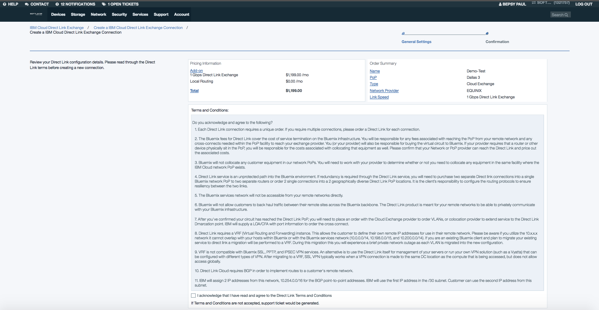

---

copyright:
  years: 2017, 2018
lastupdated: "2018-01-16"

---

{:shortdesc: .shortdesc}
{:new_window: target="_blank"}
{:codeblock: .codeblock}
{:pre: .pre}
{:screen: .screen}
{:tip: .tip}
{:download: .download}

# Order an IBM Cloud Direct Link Exchange

This page tells you how to order the IBM Cloud Direct Link Exchange service. If the IBM Cloud Direct Link order is for the Equinix Cloud Exchange, the service provisioning is fully automated, which means that you can place an order for an IBM Cloud Direct Link connection (Equinix) without opening an IBM support ticket.

**(Note: Automation capabilities currently are limited to the Equinix Cloud Exchange. In subsequent releases, automation will be enabled for other providers.)**

## Prerequisites

To use the automation capability, your private VLANs must be associated with a VRF in the IBM Cloud private network. If this requirement is not met, an IBM support ticket will be generated when you place the order through the Customer Portal.

 * [How to order Cloud Exchange](#how-to-order-cloud-exchange)
 * [How to order Cloud Exchange for Equinix](#how-to-order-cloud-exchange-for-equinix)

## How to order Cloud Exchange

To provision an IBM Cloud Direct Link Exchange connection, complete the following steps:

**Step 1:**

Log into your customer account on the [Customer Portal ](https://control.softlayer.com/).

**Step 2:**

Under the **Network** tab, select **Direct Link -> Exchange**, to open a page showing the existing IBM Cloud Direct Link connections, if any.

**Step 3:**

After clicking the **Order Direct Link Exchange** button at the top of the page, you'll see the order form where you can enter the configuration parameters for the IBM Cloud Direct Link Exchange connection.

**Step 4:**

In the order form, enter the following parameters to configure Direct Link:
  * Enter the IBM Cloud Direct Link connection name.
  * From the list, select the PoP location in which you want to establish the IBM Cloud Direct Link connection.
  * From the list, select the name of the Cloud Exchange provider you prefer.
  * Select the Link Speed required for the connection.
  * Select the routing option required for the connection.
  * Enter an ASN number from the range given in the information box for the BGP exchanges.

**Step 5:**

As you select or enter these values, you can see an approximate monthly charge on the left-side panel.

**Step 6.**

After you provide the input values, the next UI screen shows the actual monthly pricing based on the options you've selected.

**Step 7:**

You must **AGREE** to the Terms and Conditions before you can place the IBM Cloud Direct Link order. Please read the Terms and Conditions carefully, because they contain important technical information that you must understand before proceeding. **(Note: If the terms and conditions are not accepted, an IBM support ticket will be generated upon placing the order.)** The  figures that follow show the screens you may see, based on your selection at this step.

The following figure shows the Terms and Conditions screen:

The following figure shows the screen you may see if you do not agree with Terms and Conditions when you place the order. The screen shows the generated ticket number:

The following figure shows an example of the ticket being opened:

**Step 8:**

After agreeing to the terms and conditions, when you place the order, an IBM support ticket is generated after placing the order to continue with the service provisioning. The ticket number will be displayed in the UI after you place the order. 

**Step 9:**

By clicking on the ticket number in the message, you can see the ticket details.

## How to order Cloud Exchange for Equinix

**Step 1:**

Follow the steps from 1 through 7 from Cloud Exchange ordering steps above

**Step 2:**

Once you place the order, the IBM Cloud Direct Link provisioning begins.

**Step 3:**

You can see the status of your connection after you place the order. If the configuration completes on the IBM side successfully, you'll see the status as **Provisioned**. If the configuration is not finished, you'll see the status as **In-Progress**. If the configuration has failed, you'll see the status as **Create Failed**. If the configuration has completed successfully and the BGP connection is up, you'll see the status as **UP**.

The following figure shows various states of the connection after the order is placed:

**Step 4:**

If the connection is in **Provisioned** status, expand the connection by clicking the **>** in front of the connection **Name**. Then note down the **Customer IP Address** and **Service Key** information. These will be needed for configuring the customer edge router and as the authorization key for the cloud-provider-side (Equinix) configuration, respectively.

**Step 5:**

For the connections in **Provisioned** status, after expanding the connection by clicking the **>** in front of the connection, you'll see an error message if there is a mismatch with Peer Link Speed. Once the Speed is the same on the IBM side and the Equinix Side, this Error notification is no longer displayed.

**Step 6:**

For the connections in the **Create Failed** status, an IBM support ticket is generated and further details are communicated through the support ticket. When you expand the connection, you can see the support ticket details.

**Step 7:**

For the connections in **Provisioned**, **UP** or **DOWN** status, you can **Delete** the connection by clicking on the **ACTIONS** column next to the connection.

**Step 8:**

For the connections in **Create Failed** status, you can **Cancel** the connection by clicking on the **ACTIONS** column next to the connection.
