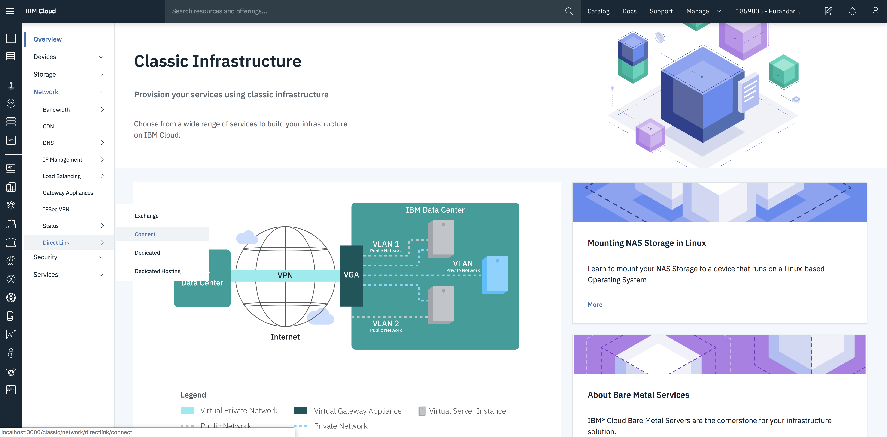
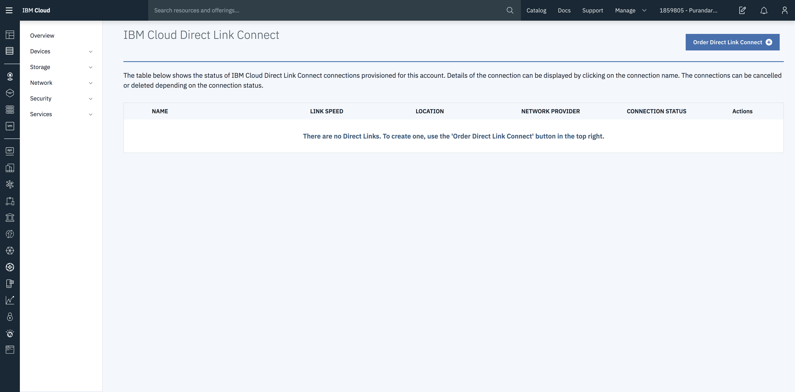
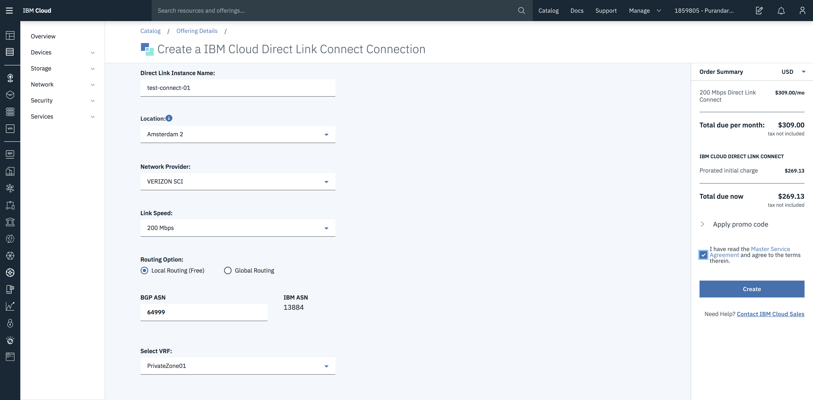
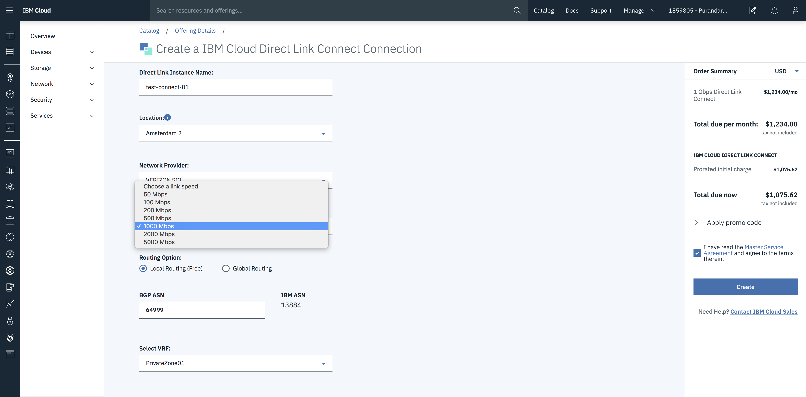
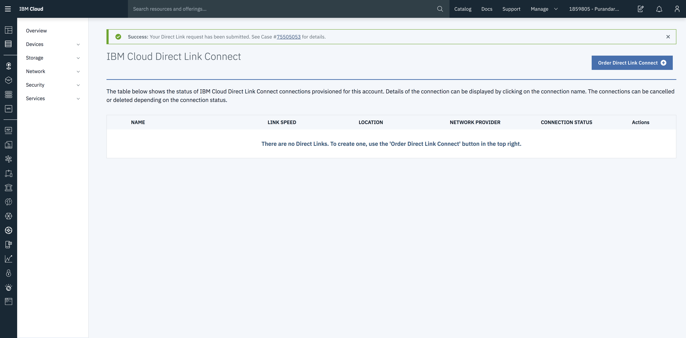
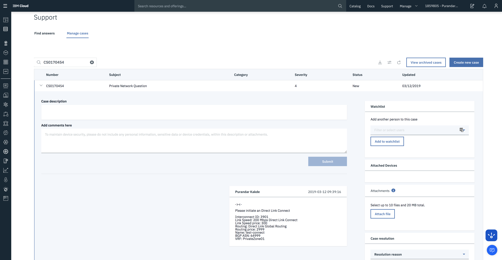

---

copyright:
  years: 2017, 2018, 2019
lastupdated: "2019-06-12"

keywords: provision, Connect, console, order, support, ticket

subcollection: direct-link

---

{:shortdesc: .shortdesc}
{:new_window: target="_blank"}
{:codeblock: .codeblock}
{:pre: .pre}
{:screen: .screen}
{:tip: .tip}
{:note: .note}
{:download: .download}
{:external: target="_blank" .external}

# Provision IBM Cloud Direct Link Connect from the UI Console
{: #provision-ibm-cloud-direct-link-connect-from-the-ui-console}

This page tells you how to order the {{site.data.keyword.cloud}} Direct Link Connect service from the {{site.data.keyword.cloud_notm}} UI Console.

After you place the order, an IBM support ticket will be generated.
{:note}

## Steps to order Direct Link Connect
{: #steps-to-order-direct-link-connect}

To provision an {{site.data.keyword.cloud_notm}} Direct Link Connect order, complete the following steps:

**Step 1:**

Log into your customer account on the [IBM Cloud console](https://cloud.ibm.com/){: external}.

**Step 2:**

Under the **Network** tab, select **Direct Link -> Connect**, to open a page showing the existing {{site.data.keyword.cloud_notm}} Direct Link connections, if any.

**Step 3:**

After clicking the **Order Direct Link Connect** button at the top of the page, you'll see the order form where you can enter the configuration parameters for your IBM Cloud Direct Link Connect order.

**Step 4:**

In the order form, enter the following parameters to configure Direct Link:

  - Enter the {{site.data.keyword.cloud_notm}} Direct Link connection name.
  - From the list, select the location in which you want to establish the {{site.data.keyword.cloud_notm}} Direct Link connection.
  - From the list, select the name of the Cloud Connect provider you prefer.
  - Select the Link Speed required for the connection.
  - Select the routing option required for the connection.
  - Enter an ASN number from the range given in the information box for the BGP exchanges.
  - Select the VRF for the connection.

**Step 5:**

As you select or enter these values, you can see an approximate monthly charge on the right-side panel.

**Step 6:**

You must AGREE to the Terms and Conditions before you can place the IBM Cloud Direct Link order. Please read the _Terms and Conditions_ carefully, because they contain important technical information that you must understand before proceeding. The figures that follow show the screens you will see, after placing the order.

The following figure shows the screen you will see after you place the order. The screen shows the generated ticket number:

The following figure shows an example of the ticket being opened:

