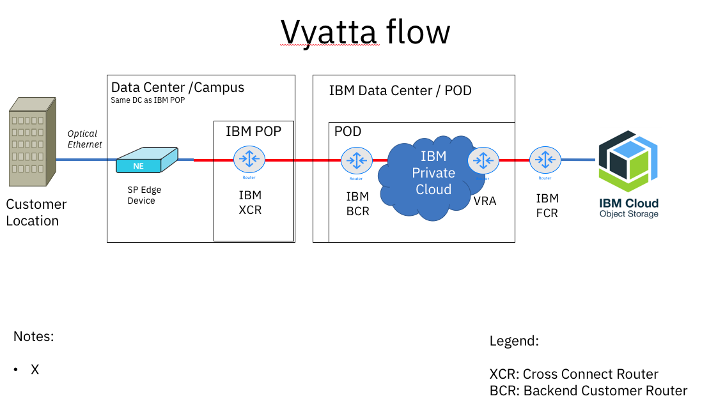

---

copyright:
  years: 2018
lastupdated: "2018-04-24"

---

{:shortdesc: .shortdesc}
{:new_window: target="_blank"}
{:codeblock: .codeblock}
{:pre: .pre}
{:screen: .screen}
{:tip: .tip}
{:download: .download}

# Together: IBM Cloud Direct Link and IBM Cloud Object Storage

This document describes how to configure IBM Cloud Direct Link so that you have access to IBM Cloud Object Storage and other IBM Cloud services. Several methods exist for bridging from the private IBM Cloud IaaS network, upon which IBM Cloud Direct Link exists, to the “public” network that supports IBM Cloud PaaS and SaaS capabilities, without actually leaving the IaaS backbone.

By current policy, IBM Cloud private service endpoints are not accessible through IBM Cloud Direct Link. The techniques described in this document rely on indirect access through systems hosted by IBM Cloud. While private service endpoints are not reachable by means of Direct Link, a customer's private servers and appliances can become reachable.

## What is IBM Cloud Object Storage (COS)?

IBM Cloud Object Storage is a web-scale platform that stores unstructured data. It provides reliability, security, availability, and disaster recovery without replication. 

Information stored with IBM Cloud Object Storage is encrypted and dispersed across multiple geographic locations. It is accessible through an implementation of the S3 API. This service makes use of the distributed storage technologies provided by the IBM Cloud Object Storage service.

IBM COS is available in two configurations: **Cross Region** and **Regional**. Cross Region service provides higher durability and availability than using a single region, but at the cost of slightly higher latency, This service is available today in the US and the EU. Regional service provides the reverse: it distributes objects across multiple availability zones within a single region. If a given region or availability zone is inaccessible, the object store continues to function smoothly. Any missed changes are applied when the inaccessible datacenter comes back online.

## What is IBM Cloud Direct Link?

IBM Cloud Direct Link is a product suite that gives customers the ability to create private connections between their remote network environments and their IBM Cloud deployments. 

## Using Cloud Object Storage (COS) over IBM Cloud Direct Link

The IBM Cloud Direct Link family of connectivity solutions is an IaaS offering, which is intended to allow private WAN connectivity to our IaaS services. Most IBM Cloud PaaS and SaaS solutions are built on top of our IaaS. Therefore, you can initiate these types of connections from within the IBM Cloud.

These three approaches can help you connect to IBM Cloud PaaS and SaaS using IBM Cloud Direct Link. Currently, Method #3 is the recommended approach, because it has been most thoroughly tested.

## Three methods for connection to PaaS and SaaS with Direct Link

### Method 1: Use a Virtual Router Appliance (VRA, sometimes called a Vyatta) to create a “hop to public”
 

**Basic Premise: Connect to IBM COS with a "public hop" to connect to the storage endpoints**
*This "public hop" never leaves the IBM Cloud IaaS backbone.*

* The customer chooses a Public endpoint with assistance from IBM COS customer support and onboarding team, and receives an API key.
* On their on-premise router, the customer adds routes to specific subnets, thereby to ensure smooth traffic flows using IBM Cloud Direct Link
* On their VRA, the customer creates a route to traverse the public network and to reach the public endpoint for IBM COS services
* The customer must provision an HA pair of VRA hardware (@x)
* Each VRA member recevies 20TB per month of included bandwidth, to offset the charges to your Public cloud metering and billing
* Use bandwidth pooling across your hosted servers to accumulate prepaid bandwisth.

### Method 2: Cloud server pass-through (private-to-private)

**Basic premise: Trust Cloud servers with COS credentials**

 * Client provisions one or more servers, VSI, or Bare Metal, in IBM Cloud
 * Each server hosts a Web-based or scripted (Java, Python, PHP, etc.) application to listen for connections and requests only on its private interface
 * Server app uses its own API or mimics (portions of) S3
 * IBM Cloud server private interfaces are fairly secure. Segregate access within private network by using VLANs, Security Groups, OS firewall or VRA
 * Measures to validate the caller and limit API reach are wise
 * Clients in customer on-prem network use cloud pass-through servers’ private IP addresses as targets for requests
 * Requires client routing and DNS changes
 * Server-hosted application handles each request by issuing an authenticated API call to a private COS endpoint, returning response to caller

### Method 3: Reverse Proxy (private-to-private)

This method is the currently recommended approach.

**Basic premise: Trust on-prem client callers with COS credentials**

 

 * As an adaptation of Method 2, instead of hosting Web apps on Cloud servers, host HTTPS servers (for example,  NGINX) configured for reverse proxy.
 * Each server listens on HTTPS, with self-issued certificate, and passes requests directly to private COS endpoint(s) which are given in the document referenced below:
 
 
 
### View an example of how to improve your cloud's reliability and performance (not specific to COS):`serverfault.com`

 * To boost scale and resiliency, multiple proxy servers can be deployed. 
 * Use round-robin DNS on the client side for rudimentary failover and load balancing capabilities.
 * Proxy servers can be placed behind VRA for protection, and for centralized logging.
 
 ## Managing and Provisioning IBM Cloud capabilities 
 
This section provides quick links to documentation for some IBM Cloud PaaS and SaaS offerings that you might connect to using IBM Cloud Direct Link.

## How to provision bare metal servers

For detailed instructions on how to provision bare metal, refer to [this document](https://console.bluemix.net/docs/bare-metal/about.html#getting-started-with-bare-metal-servers).

## How to provision a Virtual Router Appliance (VRA)

For detailed instructions on how to provision a VRA, please refer to [this document](https://console.bluemix.net/docs/infrastructure/virtual-router-appliance/getting-started.html#getting-started).

## How to provision IBM Cloud Object Storage (COS)

 * For detailed instructions on how to provision COS, refer to [this document](https://console.bluemix.net/catalog/services/cloud-object-storage).
 
 * Use one of the private endpoints (listed previously) to interface with your bucket or object in your provisioned COS account.
