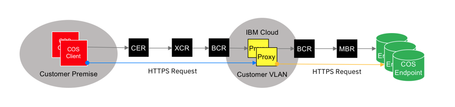

---

copyright:
  years: 2017, 2020
lastupdated: "2020-04-08"

keywords:

subcollection: direct-link

---

{{site.data.keyword.attribute-definition-list}}

# Using IBM Cloud Direct Link to connect to IBM Cloud Object Storage
{: #using-ibm-cloud-direct-link-to-connect-to-ibm-cloud-object-storage}
{: help}
{: support}

You can configure {{site.data.keyword.cloud}} Direct Link so that you have access to {{site.data.keyword.cloud_notm}} Object Storage (COS). Although the methods described here were designed and tested with COS, they can work for certain other {{site.data.keyword.cloud_notm}} services.
{: shortdesc}

By policy, {{site.data.keyword.cloud_notm}} Direct Link denies access to {{site.data.keyword.cloud_notm}} private service endpoints, including those endpoints used by COS. The technique that is described in this document relies on indirect access to COS through servers hosted in a customer's {{site.data.keyword.cloud_notm}} account. After setup, each customer's server can forward traffic bidirectionally between {{site.data.keyword.cloud_notm}} private service endpoints and their remote networks that are connected by Direct Link.

## What is IBM Cloud Object Storage?
{: #what-is-ibm-cloud-object-storage}

{{site.data.keyword.cloud_notm}} Object Storage (COS) is a web-scale solution that stores unstructured data. It provides reliability, security, availability, and disaster recovery without manual replication.

The information that is stored within {{site.data.keyword.cloud_notm}} Object Storage is encrypted and dispersed across many geographic locations. It's accessible through an implementation of the S3 API. This service uses distributed storage technologies that are provided by the {{site.data.keyword.cloud_notm}} Object Storage service.

IBM COS is available in three configurations:

* **Cross Region** service provides higher durability and availability than using a single region, but at the cost of slightly higher latency. This service is available today in the US and the EU. By using a Virtual Router Appliance (VRA), you also might use Direct Link to connect to COS in the Asia Pacific region.
* **Regional** service provides the reverse. It distributes objects across many availability zones within a single region. If a region or availability zone is inaccessible, the object store continues to function smoothly. Any missed changes are applied when the inaccessible data center comes back online.
* **Single Site** service offers affordable access to COS in a selected data center.

### COS private and public endpoints
{: #cos-private-and-public-endpoints}

Endpoints are URLs that applications use to issue COS commands and exchange data with COS. Every endpoint uses the same application programming interface (API) to interact with COS.

Servers that are provisioned within {{site.data.keyword.cloud_notm}} use private API endpoints for services, including COS. Private endpoints provide your {{site.data.keyword.cloud_notm}} servers with high-speed, direct connections to services, with no added bandwidth costs.

COS private endpoints provide {{site.data.keyword.cloud_notm}} customers with access to the same COS data that is accessible from within {{site.data.keyword.cloud_notm}}, but public endpoints permit access from any internet-equipped location.

Two caveats apply to COS public endpoints:

* Use of public endpoints can incur metered costs for bandwidth beyond the usage charges imposed by the COS service.
* Even though all data is encrypted in transit, customers can have privacy concerns or regulatory restrictions that are related to data transmitted through the internet.

## What is IBM Cloud Direct Link?
{: #what-is-ibm-cloud-direct-link}

{{site.data.keyword.cloud_notm}} Direct Link on Classic is a product suite that gives customers the ability to create secure, private connections between their remote network environments and their {{site.data.keyword.cloud_notm}} deployments. Data that is exchanged by Direct Link is never exposed to the internet.

## Using Cloud Object Storage (COS) over IBM Cloud Direct Link
{: #using-cloud-object-storage-over-ibm-cloud-direct-link}

IBM engineers developed a method that allows an {{site.data.keyword.cloud_notm}} customer who purchases COS and Direct Link to make remote connections to COS private endpoints. This type of connection extends the advantages of private service endpoints, so they can be used by client systems outside of {{site.data.keyword.cloud_notm}} facilities.

This solution is diagrammed and described in the sections that follow.

### Reverse proxy
{: #direct-link-reverse-proxy}

Basic premise: Remote clients pass requests, including secure credentials, through a private server to COS.

{: caption="Figure 1. Reverse proxy" caption-side="bottom"}

HTTPS (secure HTTP) COS requests are initiated from a client at a remote site. They're transmitted securely through {{site.data.keyword.cloud_notm}} Direct Link, targeting one of a cluster of _reverse proxy servers_ deployed in a customer’s {{site.data.keyword.cloud_notm}} account. From there, requests are passed to a COS private endpoint, processed, and then the results returned to the remote calling client.

Any sample client code that works with COS should also work through a _reverse proxy_ server. The only change that is required is that, instead of targeting a COS private endpoint URL published by IBM, the client targets the IP address or URL of the reverse proxy server.

#### Installing your Nginx reverse proxy
{: #direct-link-installing-your-nginx-reverse-proxy}

**NginX** is a mature, compact, and fast open source web server that excels at specialized tasks, including the _reverse proxy_ server role.

The instructions and configuration information that follows (for setting up an NginX reverse proxy server) can work after you adapt it to your environment. If you get stuck or need additional information, see the reverse proxy portion of the [Nginx documentation](https://docs.nginx.com/nginx/admin-guide/web-server/reverse-proxy/){: external} or search [stackoverflow](https://stackoverflow.com){: external} for examples.

1. Provision your VSI or bare metal servers with minimal **RHEL** or **CentOS** Linux build (recommended).
2. For each VSI, enable the following security group rules on the public interface: `allow_http`, `allow_https`, `allow_outbound`, `allow_ssh`
3. For each VSI, enable `allow_all` and `allow_outbound` rules on the private interface; select **Save**.
4. Using **PuTTY** in Windows or your desktop's terminal program, `ssh` into your new server as root.
5. Upgrade your operating system OS (`yum update`).
6. Install the EPEL repository (`yum install epel-release`).
7. Install NginX (`yum install nginx`).
8. Start NginX (`nginx`) and open your server's IP address in a browser.
9. The default location of `nginx.conf` is `/etc/nginx`. Create a safe copy.
10. Move the sample `nginx.conf` configuration file into `/etc/nginx`.
11. Purchase SSL certificates through the {{site.data.keyword.cloud_notm}} console or run the command `yum install easy-rsa` and see your favorite online docs for tips on creating self-signed certificates.
12. Add your certificate information to the configuration file, `nginx.conf`.
13. Test the modified NginX configuration with the command `nginx -t`.
14. If your test passes, restart `nginx` with the command `nginx -s quit; sleep 3; nginx`.
15. Your client can now submit COS requests to the IPs or URLs of the NginX (proxy) server.

**Notes:**

* The solution assumes that Direct Link was ordered and properly deployed, although it can be tested without it.
* Optional memory or disk cache can be used with `proxy_cache`.
* A longer `proxy_read_timeout` value might be needed for larger file transfers.
* Use `keepalive` or Pacemaker for High Availability (automatic failover).

**Configuration file: `nginx.conf`**

The sample configuration file is shown in the following section. You can copy and paste it.

```sh
user nginx;
worker_processes auto;
error_log /var/log/nginx/error.log;
pid /run/nginx.pid;

events {
    worker_connections 1024;
}

http {
    log_format  main  '$remote_addr - $remote_user [$time_local] "$request" '
                      '$status $body_bytes_sent "$http_referer" '
                      '"$http_user_agent" "$http_x_forwarded_for"';

    access_log  /var/log/nginx/access.log  main;

    sendfile            on;
    tcp_nopush          on;
    tcp_nodelay         on;
    keepalive_timeout   5;
    types_hash_max_size 2048;

    include             /etc/nginx/mime.types;
    default_type        application/octet-stream;
    ssl_session_cache shared:SSL:1m;
    ssl_session_timeout  10m;
    ssl_ciphers HIGH:!aNULL:!MD5;
    ssl_prefer_server_ciphers on;
    proxy_http_version 1.1;
    proxy_buffering off;
    proxy_intercept_errors on;

    # IBM COS Endpoints
    # US
    server {
        listen       443 ssl http2;
        server_name  us-cos.myibmcloud.com;
        ssl_certificate "/etc/pki/tls/certs/star.myibmcloud.com.pem";
        ssl_certificate_key "/etc/pki/tls/private/star.myibmcloud.com.key";
        location / {
            proxy_set_header Host $server_name;
            proxy_pass https://s3-api.us-geo.objectstorage.service.networklayer.com;
        }
    }

    # Dallas
    server {
        listen       443 ssl http2;
        server_name  dal-cos.myibmcloud.com;
        ssl_certificate "/etc/pki/tls/certs/star.myibmcloud.com.pem";
        ssl_certificate_key "/etc/pki/tls/private/star.myibmcloud.com.key";
        location / {
            proxy_set_header Host $server_name;
            proxy_pass https://s3-api.dal-us-geo.objectstorage.service.networklayer.com;
        }
    }
}
```

See [Endpoints and storage locations](/docs/cloud-object-storage?topic=cloud-object-storage-endpoints) for a list of private endpoints for use in these `proxy_pass` entries.

**Tips:**

* To boost scale and resiliency, deploy multiple proxy servers that are associated with different endpoints.
* Use round-robin DNS on the client side for rudimentary failover and load-balancing capabilities.
* Proxy servers can be placed behind a Virtual Router Appliance (VRA) for protection and centralized logging.

## Managing and provisioning {{site.data.keyword.cloud_notm}} capabilities
{: #direct-link-managing-and-provisioning-ibm-cloud-capabilities}

This section provides quick links to documentation for some IBM Cloud PaaS and SaaS offerings that you might connect to using {{site.data.keyword.cloud_notm}} Direct Link.

### Provisioning bare metal servers
{: #direct-link-how-to-provision-bare-metal-servers}

For detailed instructions on how to provision bare metal servers, refer to [Provisioning: Selecting from the most popular servers](/docs/bare-metal?topic=bare-metal-bm-select-popular-servers).

### Provisioning a Virtual Router Appliance (VRA)
{: #direct-link-how-to-provision-a-virtual-router-appliance}

For detailed instructions on how to provision a VRA, see the
[VRA Getting Started Guide](/docs/virtual-router-appliance?topic=virtual-router-appliance-getting-started-vra).

### Provisioning IBM Cloud Object Storage (COS)
{: #direct-link-how-to-provision-ibm-cloud-object-storage}

* For detailed instructions on how to provision COS, refer to the [Cloud Object Storage Guide](/docs/cloud-object-storage).
* Use one of the private endpoints (listed previously) to create an interface with your bucket or any object in your provisioned COS account.
