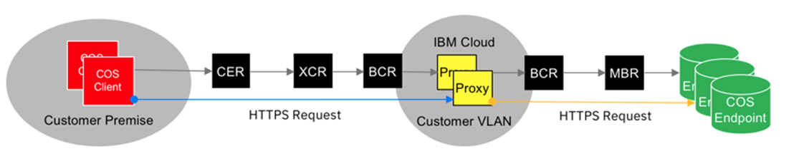

---

copyright:
  years: 2017, 2018
lastupdated: "2018-05-04"

---

{:shortdesc: .shortdesc}
{:new_window: target="_blank"}
{:codeblock: .codeblock}
{:pre: .pre}
{:screen: .screen}
{:tip: .tip}
{:download: .download}

# Together: IBM Cloud Direct Link and IBM Cloud Object Storage

This document describes how to configure IBM Cloud Direct Link so that you have access to
IBM Cloud Object Storage (COS). Although the methods described here were designed and tested with COS, they may work for certain other IBM Cloud services.

By current policy, IBM Cloud Direct Link actively denies access to IBM Cloud private service endpoints. The technique described in this document relies on indirect access through systems hosted by a customer's IBM Cloud account. Private service endpoints are not reachable by means of Direct Link, however a customer's private servers and appliances are reachable. Therefore, they can be used to forward traffic bidirectionally between IBM Cloud private service endpoints and servers connected by Direct Link.

## What is IBM Cloud Object Storage (COS)?

IBM Cloud Object Storage (COS) is a web-scale platform that stores unstructured data. It provides reliability, security, availability, and disaster recovery without manual replication.

Information stored within IBM Cloud Object Storage is encrypted and dispersed across multiple geographic locations. It is accessible through an implementation of the S3 API. This service makes use of the distributed storage technologies provided by the IBM Cloud Object Storage service.

IBM COS is available in two configurations: **Cross Region** and **Regional**. 

 * Cross Region service provides higher durability and availability than using a single region, but at the cost of slightly higher latency. This service is available today in the US and the EU.
 
  * Regional service provides the reverse: It distributes objects across multiple availability zones within a single region. If a given region or availability zone is inaccessible, the object store continues to function smoothly. Any missed changes are applied when the inaccessible datacenter comes back online.


### COS Private and Public Endpoints

Access to COS from servers provisioned within IBM Cloud relies on the use of private API endpoints. These endpoints provide our customers’ IBM Cloud servers with high-speed, direct, server-to-service connections. 
In this case, data transfers are subject only to costs related to COS service; no additional charges accrue for network usage. 

The documented way to access COS from outside IBM Cloud is to use public (internet) API endpoints. 

Public endpoints provide customers with access to exactly the same storage instances and buckets (containers for data) that are accessible from within IBM Cloud, but public endpoints permit access from anywhere. 

Two caveats apply:

 * Use of public endpoints incurs costs for bandwidth beyond the usage charges imposed by the COS service. 
 * Even though all data is encrypted in transit, customers may have privacy concerns about data transmitted by means of the internet.

## What is IBM Cloud Direct Link?

IBM Cloud Direct Link is a product suite that gives customers the ability to create secure, private connections between their remote network environments and their IBM Cloud deployments.

## Using Cloud Object Storage (COS) over IBM Cloud Direct Link

Direct Link does not permit access to IBM Cloud private service endpoints from servers outside its cloud, such as systems hosted on the customer premises or in non-IBM cloud services. From such locations, COS private API endpoints are unreachable. 

For COS customers, IBM engineers have developed a method that allows an IBM Cloud customer who has accounts on both COS and Direct Link to make remote connections through COS API private endpoints. This type of connection extends the advantages of private service endpoints to customers outside IBM Cloud facilities: 

 * It creates no exposure to the Internet, and 
 * It adds no bandwidth costs in addition to those associated with COS. 
 
 This solution is diagrammed and described in the sections that follow.

### Reverse Proxy

**Basic premise: On-prem clients pass requests, including secure credentials, through a private server to COS**



HTTPS (secure HTTP) COS requests are initiated from a client on the customer premise, they are transmitted through IBM Cloud Direct Link, and they target one of a cluster of _reverse proxy servers_ deployed in the customer’s IBM Cloud account.

These specialized web servers listen for requests from on-premise clients and relay them to official private endpoints for IBM Cloud Object Storage.

#### Setup: Configuring Nginx Reverse Proxy

* Provision VSI or bare metal servers with minimal **RHEL** or **CentOS** Linux build (recommended)
* Install EPEL Repo
* Install Nginx (use the command `yum install nginx`)
* Deploy the sample `nginx.conf` configuration file (see the sample code in the next section)
* Create and deploy SSL certificates and keys
* Start the Nginx server
* From the client, submit COS requests to the Nginx server IPs or URLs

#### Notes:

* The solution assumes that Direct Link has been ordered and properly deployed
* Optional memory or disk cache can be used with `proxy_cache`
* A longer `proxy_read_timeout` value may be needed for larger file transfers
* Use Keepalive or Pacemaker for High Availability (automatic failover)

#### Configuration file: `nginx.conf`

The sample configuration file is shown below. You can copy and paste it.

```
user nginx;
worker_processes auto;
error_log /var/log/nginx/error.log;
pid /run/nginx.pid;

events {
    worker_connections 1024;
}

http {
    log_format  main  '$remote_addr - $remote_user [$time_local] "$request" '
                      '$status $body_bytes_sent "$http_referer" '
                      '"$http_user_agent" "$http_x_forwarded_for"';

    access_log  /var/log/nginx/access.log  main;

    sendfile            on;
    tcp_nopush          on;
    tcp_nodelay         on;
    keepalive_timeout   5;
    types_hash_max_size 2048;

    include             /etc/nginx/mime.types;
    default_type        application/octet-stream;
    ssl_session_cache shared:SSL:1m;
    ssl_session_timeout  10m;
    ssl_ciphers HIGH:!aNULL:!MD5;
    ssl_prefer_server_ciphers on;
    proxy_http_version 1.1;
    proxy_buffering off;
    proxy_intercept_errors on;

    # IBM COS Endpoints
    # https://console.bluemix.net/docs/infrastructure/cloud-object-storage-infrastructure/endpoints.html#select-regions-and-endpoints
    # US
    server {
        listen       443 ssl http2;
        server_name  us-cos.myibmcloud.com;
        ssl_certificate "/etc/pki/tls/certs/star.myibmcloud.com.pem";
        ssl_certificate_key "/etc/pki/tls/private/star.myibmcloud.com.key";
        location / {
            proxy_set_header Host $server_name;
            proxy_pass https://s3-api.us-geo.objectstorage.service.networklayer.com;
        }
    }

    # Dallas
    server {
        listen       443 ssl http2;
        server_name  dal-cos.myibmcloud.com;
        ssl_certificate "/etc/pki/tls/certs/star.myibmcloud.com.pem";
        ssl_certificate_key "/etc/pki/tls/private/star.myibmcloud.com.key";
        location / {
            proxy_set_header Host $server_name;
            proxy_pass https://s3-api.dal-us-geo.objectstorage.service.networklayer.com;
        }
    }
}
```

A list of private COS endpoint URLs for use in the `proxy_pass` entries above, see [COS Endpoints](https://console.bluemix.net/docs/services/cloud-object-storage/basics/endpoints.html).

#### Tips:

 * To boost scale and resiliency, deploy multiple proxy servers associated with different endpoints.
 * Use round-robin DNS on the client side for rudimentary failover and load balancing capabilities.
 * Proxy servers can be placed behind a Virtual Router Appliance (VRA) for protection and centralized logging.

## Managing and Provisioning IBM Cloud capabilities

This section provides quick links to documentation for some IBM Cloud PaaS and SaaS offerings that you might connect to using IBM Cloud Direct Link.

### How to provision bare metal servers

For detailed instructions on how to provision bare metal, refer to the [Guide to Bare Metal Servers](https://console.bluemix.net/docs/bare-metal/about.html#getting-started-with-bare-metal-servers).

### How to provision a Virtual Router Appliance (VRA)

For detailed instructions on how to provision a VRA, please refer to the 
[VRA Getting Started Guide](https://console.bluemix.net/docs/infrastructure/virtual-router-appliance/getting-started.html#getting-started).

### How to provision IBM Cloud Object Storage (COS)

 * For detailed instructions on how to provision COS, refer to the [Cloud Object Storage Guide](https://console.bluemix.net/catalog/services/cloud-object-storage).

 * Use one of the private endpoints (listed previously) to interface with your bucket or
 object in your provisioned COS account.
