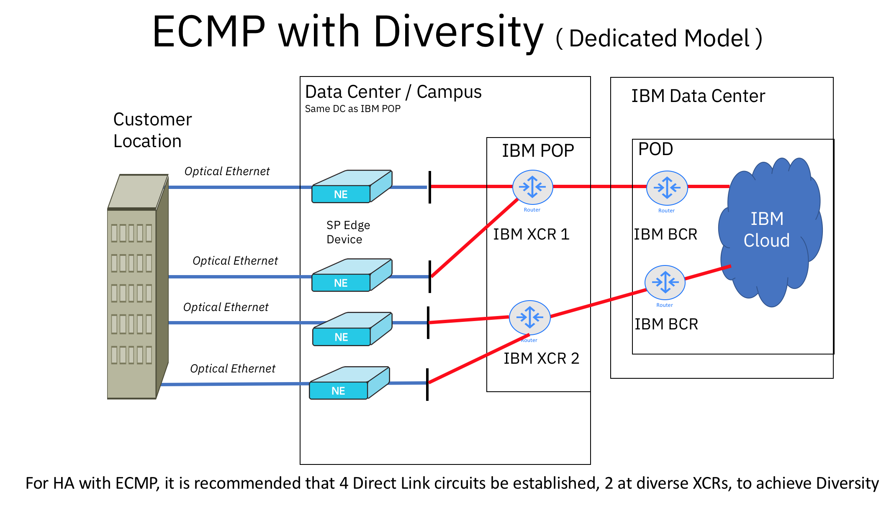

---

copyright:
  years: 2018, 2024
lastupdated: "2024-10-09"

keywords:

subcollection: direct-link

---

{{site.data.keyword.attribute-definition-list}}

# Models for diversity and redundancy in Direct Link on Classic
{: #models-for-diversity-and-redundancy-in-direct-link}

This document gives a series of schematics that are related to issues of redundancy and diversity, which can help you find a model for creating the most successful {{site.data.keyword.cloud}} Direct Link deployment to meet your needs. The schematics are arranged in increasing levels of complexity and also according to the Direct Link offering that each one is illustrating. Direct Link is not an inherently redundant service at the cross-connect router (XCR), customers have the responsibility for creating redundancy through their border gateway protocol (BGP) schemas.
{: shortdesc}

## Section 1: Relatively simple configurations that achieve diversity
{: #section-1-diversity-models}

The configurations that are shown in this group rely on the fact that all of the assets are located in the same PoP and in the same global market.

{: caption="Direct Link Exchange with diversity, in the same PoP (non-AZ)" caption-side="bottom"}

{: caption="Figure 2: Direct Link Connect with diversity in the same PoP (non-AZ)" caption-side="bottom"}

{: caption="Figure 3: Direct Link Dedicated with diversity in same PoP (non-AZ)" caption-side="bottom"}

## Section 2: Diversity that includes AZs and global routing options
{: #section-2-diversity-models}

The configurations that are shown in this group offer options for connecting across local availability zones and markets.

### Part A: Diversity in a local availability zone (AZ)
{: #section-2-part-a}

{: caption="Figure 4: Direct Link Exchange with diversity in a local AZ (WDC, DAL, FRA, LON)" caption-side="bottom"}

{: caption="Figure 5: Direct Link Connect with diversity in a local AZ (WDC, DAL, FRA, LON)" caption-side="bottom"}

{: caption="Figure 6: Direct Link Dedicated with diversity in a local AZ (WDC, DAL, FRA, LON)" caption-side="bottom"}

### Part B: Diversity in different local markets, with global routing
{: #section-2-part-b}

{: caption="Figure 7: Direct Link Connect with diversity and global routing" caption-side="bottom"}

{: caption="Figure 8: Direct Link Exchange with diversity and global routing" caption-side="bottom"}

{: caption="Figure 9: Direct Link Dedicated with diversity and global routing" caption-side="bottom"}

## More about ECMP
{: #more-about-ecmp}

Equal-cost multipath (ECMP) is a feature of BGP. Some customers asked IBM about using ECMP as a way to achieve redundancy. However, ECMP alone is not sufficient.

**Currently, ECMP is not available on the direct link router as an option. ECMP balancing with IBM Cloud only extends to the cross-connect routers (XCRs). Past the XCRs, the ECMP-based traffic presents itself as the same IP address to the IBM Cloud network, and the IBM Cloud network routing defaults to the shortest path found. This means that only one of the direct links in the ECMP configuration is usable at a given time.**

Customers can request a network exception to have ECMP configured for two classic direct links on the same direct router. However, network exceptions are subject to engineering review and might not be possible in all cases.
{: note}

**Q: Is ECMP the way to go for redundant connections? What alternatives exist?**

ECMP isn’t designed for creating redundant connections but for balancing the load over two links. With ECMP on {{site.data.keyword.cloud_notm}}, both connections must terminate to the same IBM Cloud XCR, which makes it a single point of failure. (In other words, ECMP can be provisioned as two sessions only on the same {{site.data.keyword.cloud_notm}} XCR.)

{: caption="Figure 10: ECMP provisioning" caption-side="bottom"}

### Achieving diversity and redundancy
{: #how-to-achieve-diversity-and-redundancy}

If you are looking for High Availability (HA), or full redundancy, set up two links into different XCRs in the same data center (for example DAL03). Then, fail over as needed using BGP configurations.

{: caption="Figure 11: ECMP with Dual XCRs" caption-side="bottom"}

## Direct Link BGP path selection
{: #dl-bgp-path-selection}

In the situation where the same route prefixes are being advertised to IBM Cloud through the BGP session for Direct Link, a customer can prepend one or more Autonomous System Number (ASN) to the route advertisement. AS prepend makes the AS path longer, and therefore, the route for the prefix is less preferred by the BGP protocol on the IBM Cloud router.

The ASN used for the prefix can be the same ASN as the local AS on the BGP session that is performing the prepend.
{: note}

IBM Cloud Direct Link does not allow path preference for route prefixes received from the customer with the following BGP attributes:

* Weight
* Local preference
* Multiple Exit Discriminator (MED)

Finally, if the duplicate route prefixes are received with the same AS path length from different origin routers, IBM Cloud gives preference to the oldest route received. In other words, the first BGP session that advertises a given route prefix receives path preference.

Similar rules apply on the route prefixes that IBM Cloud advertises to the customer. The IBM Cloud routers advertise all prefixes that are associated with all applicable Direct Link connections equally (through BGP) with no additional BGP attributes to indicate path preference. The customer can implement import policies of their choice to prevent asymmetric routing scenarios that align with any existing export policies.
