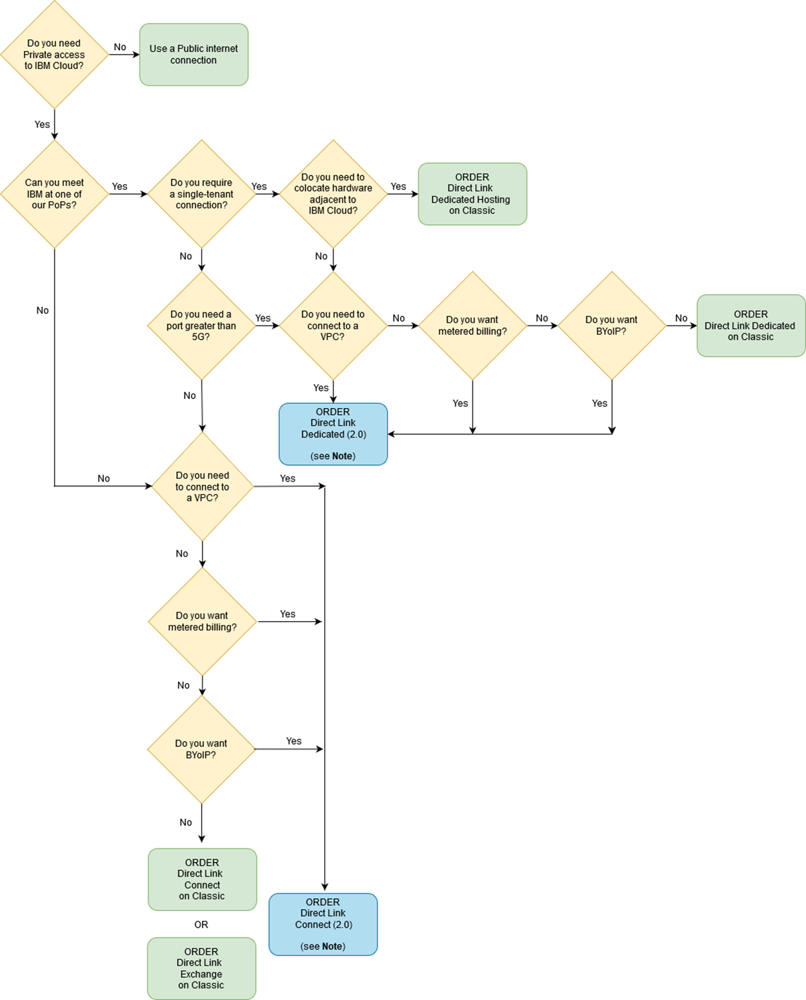

---

copyright:
  years: 2017, 2025
lastupdated: "2025-08-08"

keywords:

subcollection: direct-link

---

{{site.data.keyword.attribute-definition-list}}

# IBM Cloud Direct Link on Classic
{: #get-started-with-ibm-cloud-direct-link}

## How do I know which Direct Link solution to order?
{: #get-started-solution-to-order}

IBM Cloud® Direct Link on Classic is a suite of solutions from the IBM Cloud network, with availability in locations around the globe. Each one enables customers to create direct, private connections between their remote network environments and their IBM Cloud deployments, without touching the public internet. Most commonly, these offerings are implemented to support private, hybrid, and cross-provider workloads, as well as large or frequent data transfers.

Use this decision tree to help you decide which solution works best for you. If you want help with getting started, you can open an IBM Support case through the [IBM Cloud console](/unifiedsupport/cases/add){: external}, or contact your {{site.data.keyword.cloud_notm}} sales representative.

{: caption="Direct Link decision tree" caption-side="bottom"}

For more information about the new Direct Link offerings, see [Getting started with IBM Cloud Direct Link](/docs/dl?topic=dl-get-started-with-ibm-cloud-dl).
{: note}

When you're ready to order, follow the step-by-step instructions for the specific Direct Link solution that you need. After you place your order, you'll be asked to complete a questionnaire related to your solution and workload requirements.

   Currently, there isn't a migration path from {{site.data.keyword.dlc_short}} offerings to the new IBM Cloud Direct Link. You must order a Direct Link Dedicated or Direct Link Connect connection.
   {: important}

## Learn more
{: #dl-learn-more}

If you require a diverse and redundant Direct Link on Classic deployment, review the [Models for diversity and redundancy document](/docs/direct-link?topic=direct-link-models-for-diversity-and-redundancy-in-direct-link).

If you require a diverse, redundant, or multi-cloud deployment for Direct Link Connect on Classic or Direct Link Exchange on Classic, you can review the [Alternatives document](/docs/direct-link?topic=direct-link-alternatives-for-your-ibm-cloud-direct-link-deployment).
